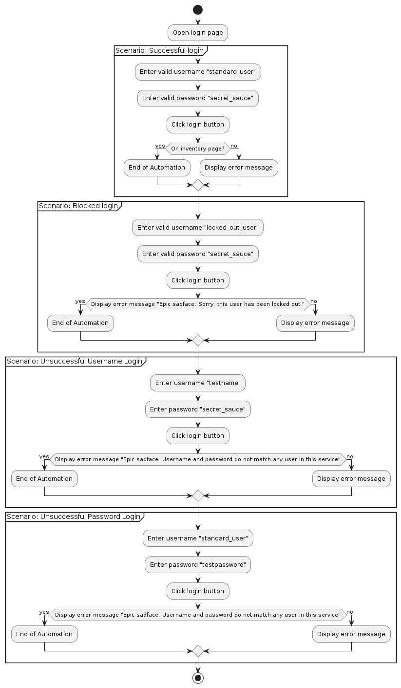
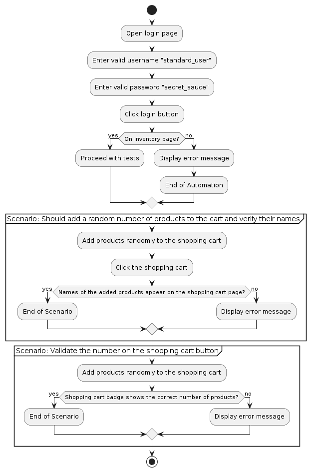

# Cypress Test Automation Project

## Description
Practice project using Cypress for automated testing, incorporating Cucumber for BDD and implementing the Page Object Model (POM) design pattern.

## Technologies Used
- Cypress
- Cucumber
- JavaScript
- Page Object Model (POM)

## Project Structure

- **.cypress-cucumber-preprocessorrc.json**: Configuration for the Cypress Cucumber preprocessor.
- **.gitignore**: Git ignore file.
- **cypress.config.js**: Cypress configuration file.
- **cypress.env.json**: Environment configuration for Cypress.
- **jsconfig.json**: Configuration file for JavaScript projects.
- **package-lock.json**: Dependency lock file.
- **package.json**: Project metadata and dependencies.
- **README.md**: This file, providing project overview and setup instructions.

### Project Folders

- **cypress/**
  - **downloads/**: Folder for downloaded files during tests.
  - **e2e/**: End-to-end test files organized by sprints.
    - **features/**: Cucumber feature files categorized by sprints.
      - **Sprint1/**
        - **UH1_Login.feature**: Feature file for user story related to login functionality in Sprint 1.
      - **Sprint2/**
        - **UH2_FilteringProducts.feature**: Feature file for user story related to product filtering in Sprint 2.
      - **Sprint3/**
        - **UH_Cart.feature**: Feature file for user story related to cart functionality in Sprint 3.
      - **Sprint4/**
        - **UHFlow_PurchaseProducts.feature**: Feature file for user story related to purchase flow in Sprint 4.
    - **pages/**: Page Object Model (POM) classes for different application pages.
      - **CartPage.js**: Page Object for cart page interactions.
      - **CheckOutCompletePage.js**: Page Object for checkout complete page interactions.
      - **CheckOutStep1Page.js**: Page Object for checkout step 1 interactions.
      - **CheckOutStep2Page.js**: Page Object for checkout step 2 interactions.
      - **InventoryPage.js**: Page Object for inventory page interactions.
      - **LoginPage.js**: Page Object for login page interactions.
    - **step_definitions/**: Step definitions for Cucumber scenarios categorized by sprints.
      - **Sprint1/**
        - **UH1_Login.js**: Step definitions for login feature in Sprint 1.
      - **Sprint2/**
        - **UH2_FilteringProducts.js**: Step definitions for product filtering feature in Sprint 2.
      - **Sprint3/**
        - **UH_Cart.js**: Step definitions for cart feature in Sprint 3.
      - **Sprint4/**
        - **UHFlow_PurchaseProducts.js**: Step definitions for purchase flow feature in Sprint 4.

  - **fixtures/**: Test data files or fixtures used in tests.
    - **example.json**: Example JSON data used for testing.

  - **report/**: Generated test reports.
    - **output.html**: Main HTML report file.
    - **output.json**: Merged JSON report file.
    - **mochawesome-report/**: Detailed Mochawesome HTML reports.
      - **mochawesome.html**: Main Mochawesome HTML report file.
      - **mochawesome.json**: Main Mochawesome JSON report file.
      - **mochawesome_001.html**, **mochawesome_001.json**: Additional Mochawesome report files.
      - **assets/**: Assets used in the HTML reports (e.g., CSS, JavaScript, fonts).

  - **support/**: Cypress support files.
    - **commands.js**: Custom Cypress commands.
    - **e2e.js**: Additional support functions or configurations specific to end-to-end tests.

  - **videos/**: Recorded test execution videos categorized by sprints.
    - **Sprint1/**
      - **UH1_Login.feature.mp4**: Video recording of tests related to login feature in Sprint 1.
    - **Sprint2/**
      - **UH2_FilteringProducts.feature.mp4**: Video recording of tests related to product filtering feature in Sprint 2.
    - **Sprint3/**
      - **UH_Cart.feature.mp4**: Video recording of tests related to cart feature in Sprint 3.
    - **Sprint4/**
      - **UHFlow_PurchaseProducts.feature.mp4**: Video recording of tests related to purchase flow feature in Sprint 4.

### Scripts

```json
"scripts": {
  "cypress:open": "cypress open",
  "cypress:runner": "cypress open --e2e --browser chrome",
  "cypress:run-all": "cypress run --reporter mochawesome && npm run merge-reports",
  "cypress:regression-tag": "cypress run --env tags=@regression --reporter mochawesome && npm run merge-reports",
  "cypress:smoke-tag": "cypress run --env tags=@smoke --reporter mochawesome && npm run merge-reports",
  "merge-reports": "mochawesome-merge cypress/report/mochawesome-report/*.json > cypress/report/output.json && marge cypress/report/output.json --reportDir ./ --inline"
}
```

### DevDependencies
```json
"devDependencies": {
  "@badeball/cypress-cucumber-preprocessor": "^20.1.0",
  "@bahmutov/cypress-esbuild-preprocessor": "^2.1.5",
  "@faker-js/faker": "^8.4.1",
  "@shelex/cypress-allure-plugin": "^2.34.0",
  "cypress": "^13.12.0",
  "esbuild": "^0.16.4",
  "mochawesome": "^7.1.3",
  "mochawesome-merge": "^4.3.0",
  "mochawesome-report-generator": "^6.2.0",
  "multiple-cucumber-html-reporter": "^3.0.1"
}
```

### Setup Instructions

  - **Clone Repository/**: git clone https://github.com/TatianaCerifi/cerifi-qa-assesment/tree/nicolas-ortiz
  - **Install Dependencies/**: npm install
  - **Run Cypress GUI/**: npm run cypress:open
  - **Run Cypress Tests/**:
      - All tests: npm run cypress:run-all
      - Regression tests: npm run cypress:regression-tag
      - Smoke tests: npm run cypress:smoke-tag

### Notes
  - Ensure proper environment variables are set in cypress.env.json for different test environments.

### Flowcharts
**UH1_Login | The login page will function according to the user's credentials.**



**UH2_FilteringProducts | The products page should apply filters and maintain sorting.**


**UH_Cart | Select random products and verify them in the shopping cart.**



**UHFlow_PurchaseProducts | Performing the complete flow for purchasing products**


# QA Automation Assessment

Welcome to the QA Automation assessment. You will be testing a fictional e-commerce application, SauceDemo, to ensure its functionality and user experience are robust.

## Challenge

We would like you to write end-to-end (E2E) tests for the SauceDemo application at [SauceDemo](https://www.saucedemo.com/) using Cypress. You have the freedom to choose a design pattern that you believe is suitable for this project. Your design choices will be assessed in the justification phase, so be mindful of your decisions.

## Objectives

- **Technical Skills**: Demonstrate your proficiency with Cypress by automating tests for the application.
- **Prioritization**: Show how you prioritize features to test, ensuring the most critical functionalities are covered.
- **Future-proofing**: Illustrate how your framework can be scalable and maintainable for future enhancements.
- **Documentation**: Include detailed documentation on how to set up and run your tests, ensuring that an interdepartmental team can easily follow your instructions.

## Instructions

1. **Fork and Clone**:
   - Fork this repository to your GitHub account.
   - Clone the forked repository to your local machine.

2. **Create a Branch**:
   - Create a new branch named `firstName-lastName` (e.g., `john-doe`).

3. **Write Your Scripts**:
   - Write your Cypress test scripts in the `cypress/e2e` folder.
   - Design and implement a framework that you believe is appropriate for the project.

4. **Documentation**:
   - Provide comprehensive documentation on how to run the tests.
   - Justify your design choices and explain how your framework can accommodate future needs.

5. **Commit and Push**:
   - Commit your changes with a meaningful message.
   - Push your branch to your GitHub repository.

6. **Pull Request**:
   - Submit a pull request to the original repository.

## Considerations

- Focus on creating a robust and maintainable test suite.
- Think about how you would structure your tests to cover critical functionalities.
- Ensure your documentation is clear and detailed enough for an interdepartmental team to understand and follow.

## Example Setup Instructions

Include the following in your documentation:

1. **Installation**:
   - Steps to install Cypress and any other dependencies.

2. **Running Tests**:
   - Commands to execute the test suite.

3. **Framework Explanation**:
   - A brief overview of the design pattern used and its benefits.

4. **Future-proofing**:
   - Explain how your framework can be extended or maintained as the application grows.

Good luck! 🍀


